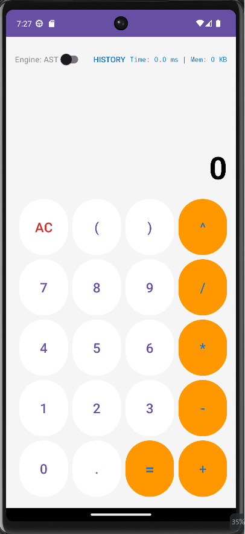

# 電卓アプリ 仕様書

## ■ 基本情報
| **作成日（最終更新日）**      | **作成者**            |
|:--------------------|:-------------------|
| 2026年6月23日          | 大西                 |

文書種別 : 社内限（開発・テストチーム共有文書）
---

## ■ 1. 画面構成とパーツ説明

### 1.1. メイン画面イメージ
> 💡 **マニュアル・試験項目作成用メモ**:

#### 【メイン画面】 各パーツの説明
* **[1] アルゴリズム切替スイッチ (`switch_algorithm`)**
    * 計算エンジン（ASTモード / RPNモード）を切り替えるトグルスイッチ。
* **[2] 数式表示エリア (`tv_expression`)**
    * ユーザーがタップしたボタンに応じて、リアルタイムに構築される数式文字列を表示するエリア。
* **[3] 結果表示エリア (`tv_result`)**
    * `=` 押下後の計算結果、またはエラーメッセージ（`Error`）を表示するエリア。初期値は `0`。
* **[4] 統計情報エリア (`tv_stats`)**
    * 計算にかかった時間と消費メモリを表示するエリア。初期値は空白。
* **[5] 入力キーパッド（各種ボタン）**
    * 数字（0-9）、小数点（.）、四則演算子（`+`,`-`,`*`,`/`）、累乗（`^`）、括弧（`(`, `)`）、実行（`=`）、履歴（`btn_history`）、およびクリアボタン（`btn_ac`）。

---

### 1.2. 履歴ダイアログ画面イメージ
> 💡 **マニュアル・試験項目作成用メモ**:
> 以下の部分に、実際に「HISTORY」ボタンを押して履歴リストが立ち上がっている状態のスクリーンショット画像を配置（差し替え）してください。

#### 【履歴ダイアログ画面】 各パーツの説明
* **[1] ダイアログタイトル**
    * `計算履歴` と表示されるヘッダーエリア。
* **[2] 履歴リスト項目**
    * 過去の計算が「数式 ＝ 結果 (計算モード)」の形式で一覧表示されるエリア。
* **[3] 閉じるボタン**
    * ダイアログを破棄してメイン画面に戻るためのネガティブボタン。

---

## ■ 2. 画面遷移と動的挙動
ユーザーの操作に対して、見た目がどのように変化するかを定義します。

### 2.1. 通常の入力と計算実行
1. **初期状態**: 数式表示は空、結果表示は `0`。
2. **キー入力時**: 数字や演算子ボタンを押すと、その文字が **数式表示エリア** の末尾に即座に追加される。
3. **計算実行時**: `=` ボタンを押すと、計算処理が走り、結果が **結果表示エリア** に表示される。同時に、**統計情報エリア** にパフォーマンス（Time / Mem）が表示される。
4. **計算実行直後の入力**: `=` 実行直後に演算子（`+` など）を押した場合、前回の結果を引き継いで数式が継続される。数字を押した場合は、前の数式が自動クリアされ、新しい入力として開始される。

### 2.2. クリアボタン（AC / C）の動的トグル挙動
状況に応じて、同一ボタンのテキストと挙動が以下のように変化する。
* **「C」状態（文字消去モード）**
    * **遷移条件**: 数式表示エリアに1文字でも入力があり、かつ `=` を押す前の状態。
    * **ボタン表示**: 表示文字が `C` に変化する。
    * **操作時の挙動**: ボタンをタップすると、数式表示エリアの **末尾から1文字だけ** が消去される（バックスペース挙動）。
* **「AC」状態（全消去モード）**
    * **遷移条件**: アプリ起動直後（数式が空）、または `=` を押して計算結果が出た直後。また、`C` を連打して数式が完全に空になった瞬間。
    * **ボタン表示**: 表示文字が `AC` に変化する。
    * **操作時の挙動**: ボタンをタップすると、数式・結果（0リセット）・統計情報（初期化）のすべてが完全に初期状態に巻き戻る。

### 2.3. 履歴ダイアログの表示と復元挙動
1. **ダイアログ表示**: `[HISTORY]` ボタンを押すと、「計算履歴」というタイトルのダイアログ（ポップアップ窓）が前面に表示される。
2. **並び順**: ダイアログ内には、**直近に計算した最新の履歴が一番上（最上部）** にくるように並ぶ。
3. **復元遷移**: 履歴のいずれか1件をタップすると、ダイアログが閉じ、当時入力していた「数式」「計算結果」「使用した計算エンジン（スイッチの状態）」がメイン画面に完全復元される。
4. **空振りの挙動**: 履歴が1件もない状態で `[HISTORY]` ボタンを押した場合、ダイアログは開かず、画面上部にメッセージを表示する（仕様4. メッセージ表示参照）。

### 2.4. ボタンの打鍵感フィードバック
* **挙動**: キーパッドのいずれかのボタンに指が触れている（押し下げている）間、該当ボタンの背景色が通常時より **1トーン暗い色** に変化し、指を離すと元の色に戻る。

---

## ■ 3. 制限値
試験項目の「限界値テスト」の基準となる上限値・下限値です。

* **画面表示可能桁数（上限値）**: 結果表示エリアに表示できる数値は、整数部・小数部を合わせて **最大10桁** までとする。これを超える結果となる計算は、すべて表示エラーとする。
* **極小値の丸め限界（下限値）**: 計算結果の絶対値が 10⁻⁶（0.000001）未満になった場合、画面表示上は一律 `0` として丸めて表示する。
* **計算履歴の最大保持件数**: メモリ上に保存できる履歴は **最大10件** までとする。11件目の計算が実行された場合、内部で最も古い（1番最初に計算された）履歴が自動的に押し出されて完全消去される（FIFO制御）。
* **累乗（^）の指数制限**: `A ^ B` の計算において、指数 `B` に指定できるのは「実質的な整数（例: `2` や `2.00`）」のみとする。純粋な小数（例: `2.5`）が指定された場合は、計算不能としてエラー処理を行う。

---

## ■ 4. メッセージ表示
スナックバー（画面上部・Statsエリアの直下）にポップアップ表示される警告メッセージの条件と文言の精査一覧です。

| # | 表示される背景・条件（発生トリガー） | 具体的な表示文言（トースト/スナックバー） |
| :--- | :--- | :--- |
| 1 | アルゴリズム切替スイッチを切り替えたとき | `"エンジンを切り替えました"` |
| 2 | 計算結果が10桁の表示制限値を超えたとき | `"表示可能な桁数を超えました"` |
| 3 | 数式の構文エラー（カッコが閉じられていない、演算子が連続している、ゼロ除算など）が発生したとき | `"[エラーの原因に応じたメッセージ]"` 例: `"ゼロで割ることはできません"` など |
| 4 | システムの予期せぬクラッシュ、または未定義の計算エラーが発生したとき | `"計算エラーが発生しました"` |
| 5 | 計算履歴が1件もない状態で、`[HISTORY]` ボタンを押したとき | `"履歴がありません"` |
| 6 | 履歴ダイアログから過去の履歴を選択し、画面に反映させたとき | `"履歴を復元しました"` |

---

## ■ 5. その他（外部モジュール・ライセンス）
* **Material Components for Android (Google)**
    * 適用箇所: UIコンポーネント（スイッチ、ボタン、スナックバーの構造）
    * ライセンス: Apache License 2.0 に準拠。製品上でのライセンス表記等の義務はないが、内部仕様として明記する。